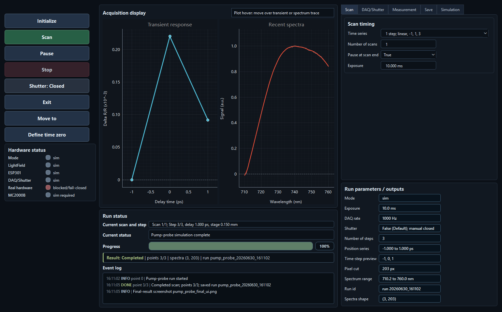
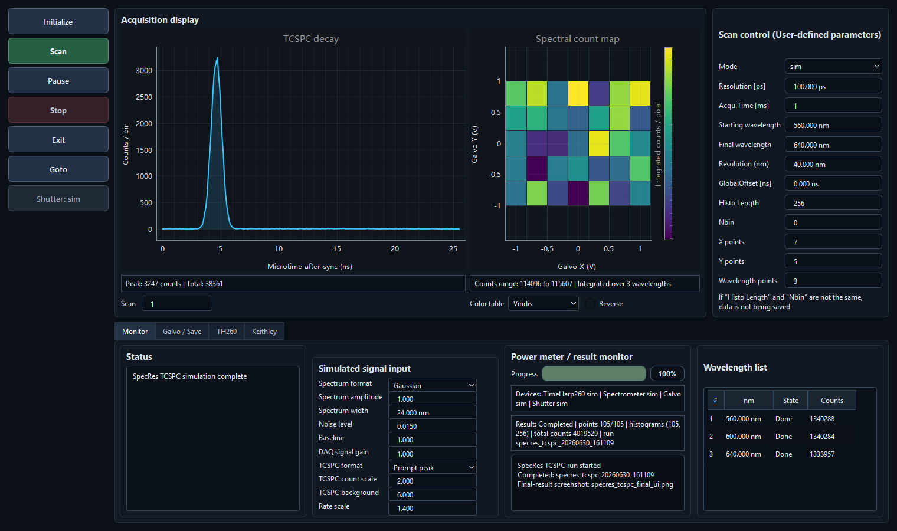

<div align="center">

# LabVIEW to Python Industrial

**Replace LabVIEW measurement applications with auditable Python software.**

[English](README.md) · [简体中文](README.zh-CN.md) · [日本語](README.ja.md)

[](https://github.com/k-telux/labview-to-python/actions/workflows/validate.yml)
[](https://agentskills.io/)
[](https://www.python.org/)
[](#evidence-boundary)
[](LICENSE)



</div>

An evidence-gated Agent Skill and reusable rule for migrating laboratory and
industrial LabVIEW applications to Python without losing measurement behavior,
data lineage, hardware safety, operator usability, or packaged-runtime proof.

> **Independent community project.** This repository does not ship vendor SDKs,
> certify connected instruments, or turn simulator success into a real-hardware
> claim. Hardware remains unvalidated until an approved fail-closed dry run.

## Why this skill

| Measurement truth | Operator-ready UI | Delivery evidence |
|---|---|---|
| Inventories VI/subVI behavior, resolves one immutable scan plan, and compares workflow, saved, plot, and heatmap data. | Covers industrial and LabVIEW-style interfaces, real clicks and hover, compact/wide layouts, screenshots, and human visual review. | Separates simulator, source UI, packaged EXE, shortcuts, and real hardware; stale binaries and inherited PASS states are rejected. |

## Real migration results

| Pump-probe acquisition | Spectroscopy and TCSPC mapping |
|---|---|
|  |  |

These sanitized completion-state screenshots come from real migration
verification artifacts. The [visual case study](examples/showcase/README.md)
explains the demonstrated workflow and the evidence boundary. Textual
[input/output cases](examples/README.md) cover supervision, heatmap parity, and
packaged-EXE acceptance.

## Install

With a compatible Agent Skills installer:

```bash
npx skills add k-telux/labview-to-python \
  --skill labview-to-python-industrial
```

For Codex explicitly:

```bash
npx skills add k-telux/labview-to-python \
  --skill labview-to-python-industrial \
  --agent codex
```

Manual Codex installation:

```powershell
Copy-Item -Recurse -Force `
  .\skills\labview-to-python-industrial `
  $env:USERPROFILE\.codex\skills\
```

## Quick start

### Migrate an application

```text
Use $labview-to-python-industrial to migrate this LabVIEW measurement VI to
Python. Preserve the real scan workflow, add a deterministic simulator, prove
saved and displayed data parity, and package only after source UI approval.
```

### Audit an existing migration

```text
Audit this LabVIEW-to-Python project. Trace every visible parameter into the
resolved scan plan, compare workflow/disk/plot arrays independently, and report
simulator, source UI, EXE, and real hardware as separate statuses.
```

### Diagnose performance or heatmap defects

```text
Use $labview-to-python-industrial to diagnose this slow scan and misregistered
heatmap. Preserve the full workload, measure core and click-to-Completed time,
and verify first/middle/last heatmap cells with real mouse hover.
```

## How it works

1. Inventory VI/subVI states, controls, units, errors, files, and hardware calls.
2. Resolve visible controls into one scan plan shared by execution and metadata.
3. Keep real adapters and deterministic simulators behind the same workflow.
4. Prove workflow result, saved readback, plots, and heatmaps independently.
5. Exercise source UI with real interaction and fresh target-window screenshots.
6. Rebuild and run the exact EXE only after the source gate is approved.

## Acceptance gates

| Gate | Required proof | Does not prove |
|---|---|---|
| Logic and data | Resolved plan, independent fixtures, arrays, masks, units, saved readback | UI, EXE, hardware |
| Simulator | Deterministic workflow and adapter-boundary behavior | Vendor driver or instrument |
| Source UI | Real interactions, terminal state, plots, screenshots, visual audit | Packaged runtime |
| Packaged EXE | Current-source lineage, hashes, shortcuts, real workflows, saved outputs | Real hardware |
| Real hardware | Approved dry run, limits, communication, cleanup, acquired outputs | Unconnected or optional devices |

Quick previews are interaction checks, not production-resolution parity. A
target-derived CSV roundtrip is labeled as such and never presented as an
independent LabVIEW algorithm oracle.

## Example workflows

| Case | What it demonstrates |
|---|---|
| [Dual-project supervision](examples/01-dual-project-orchestration/) | Hard ownership boundaries, shared workflow requirements, and independent phase statuses. |
| [Performance and heatmap gate](examples/02-performance-heatmap-gate/) | Full-workload timing, verifier-induced slowdown, array orientation, and real-hover registration. |
| [Packaged EXE gate](examples/03-packaged-exe-gate/) | Source freshness, root/dist identity, shortcut integrity, packaged interaction, and output readback. |

## Practical advantages

- **No UI-only rewrites:** visible controls must affect the executed scan plan.
- **No self-proof:** target-vs-target comparisons and setter-driven hover checks fail.
- **No status inflation:** source, simulator, EXE, and hardware verdicts stay separate.
- **No silent partial data:** stopped scans retain masks and `NaN` semantics.
- **No stale delivery:** relevant source or verifier changes invalidate old EXEs.
- **No unsafe process cleanup:** ownership is checked before terminating a process.

## Repository map

```text
skills/labview-to-python-industrial/   canonical English skill and references
rules/                                 derived project rule summaries
examples/showcase/                     sanitized visual migration case
examples/01..03/                       real-history input/output cases
README.zh-CN.md                        Simplified Chinese entry point
README.ja.md                           Japanese entry point
scripts/validate_repo.py               dependency-free release gate
```

The English [SKILL.md](skills/labview-to-python-industrial/SKILL.md) is the
technical source of truth. Localized README and rule files are human-facing
entry points and defer to the canonical skill when wording differs.

## Validate

```bash
python scripts/validate_repo.py
```

Codex users can also run the bundled skill validator:

```powershell
py $env:USERPROFILE\.codex\skills\.system\skill-creator\scripts\quick_validate.py `
  .\skills\labview-to-python-industrial
```

## Evidence boundary

- SDK files and hashes prove inventory, not communication or calibration.
- Screenshots prove visible states only when tied to real interaction and data.
- Build success is not packaged-runtime success; the exact EXE must be run.
- Real hardware requires instrument-specific manuals, safety limits, operator
  approval, and an actual controlled test.
- Published screenshots are sanitized examples, not universal hardware support
  claims or downloadable applications.

See [CONTRIBUTING.md](CONTRIBUTING.md) for new adapters, rules, and case studies,
and [SECURITY.md](SECURITY.md) for responsible disclosure.

Maintained by [telux](https://github.com/k-telux). Released under the
[MIT License](LICENSE).
