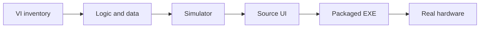

# LabVIEW to Python Industrial Skill

[](https://github.com/k-telux/labview-to-python-industrial-skill/actions/workflows/validate.yml)
[](LICENSE)
[](https://agentskills.io)

An evidence-gated Agent Skill and reusable rule for replacing LabVIEW laboratory
and industrial measurement applications with Python without losing experiment
logic, data lineage, hardware safety, UI integrity, or packaged-runtime proof.

Author: **telux**

[简体中文](docs/README.zh-CN.md) | [日本語](docs/README.ja-JP.md) | English

## Why This Exists

LabVIEW migrations often appear complete while still executing hidden fixed scan
axes, misreporting partial data, accepting simulated hover helpers as UI proof, or
shipping an EXE that no longer matches the source. This project turns lessons
from real pump-probe migrations into a portable workflow with explicit gates.

## What It Covers

- VI/subVI behavior inventory and immutable resolved scan plans
- one workflow shared by real adapters, simulators, and multiple UIs
- SDK inventory, hardware call-order evidence, limits, and fail-closed cleanup
- full-resolution data, saved-file, plot, and heatmap parity
- industrial and LabVIEW-style UI design with real interaction screenshot QA
- user-path performance diagnostics and verifier-induced slowdown detection
- source-to-EXE lineage, root/dist hash identity, shortcuts, and runtime gates
- multi-project supervision with hard ownership and phase boundaries

## Install

### Skills CLI

```bash
npx skills add k-telux/labview-to-python-industrial-skill \
  --skill labview-to-python-industrial
```

For Codex explicitly:

```bash
npx skills add k-telux/labview-to-python-industrial-skill \
  --skill labview-to-python-industrial \
  --agent codex
```

### Manual Codex Install

```powershell
Copy-Item -Recurse -Force `
  .\skills\labview-to-python-industrial `
  $env:USERPROFILE\.codex\skills\
```

The skill is self-contained. If an agent also supports project rules, the
[derived rule excerpt](rules/labview-to-python-industrial.md) may be copied into
`AGENTS.md` or `.agents/rules/`; `SKILL.md` remains the operational source.

## Use

```text
Use $labview-to-python-industrial to migrate this LabVIEW measurement VI into a
Python application. Preserve the real workflow, add a deterministic simulator,
verify the source UI with real interactions, and package only after source gate
approval.
```

The skill also triggers for LabVIEW-to-Python audits, industrial PySide/PyQt UI,
hardware SDK migration, simulator parity, heatmap or performance regressions, and
Windows EXE verification.

## Gate Model



Each gate has independent evidence and status. Simulator or source success never
upgrades packaged EXE or real hardware automatically.

## Repository Layout

```text
skills/labview-to-python-industrial/
  SKILL.md
  agents/openai.yaml
  references/
rules/
examples/
docs/
scripts/validate_repo.py
```

The English `SKILL.md` is the only operational source. The standalone rule and
Chinese/Japanese files are derived human-facing summaries.

## Real Input/Output Examples

The [examples](examples/README.md) contain sanitized input/output pairs derived
from three real project histories:

- dual regular-map and power-dependent migration supervision;
- performance, heatmap, and UI source-gate diagnosis;
- clean packaged-EXE lineage and runtime verification.

They preserve the original engineering decisions while removing personal paths,
private binaries, and vendor-licensed material.

## Validate

```bash
python scripts/validate_repo.py
```

Codex users can also run the official skill validator:

```powershell
py $env:USERPROFILE\.codex\skills\.system\skill-creator\scripts\quick_validate.py `
  .\skills\labview-to-python-industrial
```

## Evidence Boundary

This repository provides a workflow and validation contract. It does not ship
vendor SDKs, prove hardware compatibility, or replace instrument manuals,
calibration, operator approval, or laboratory safety procedures.

## Contributing And Security

See [CONTRIBUTING.md](CONTRIBUTING.md) for changes and [SECURITY.md](SECURITY.md)
for responsible disclosure. Never commit credentials, licensed SDK binaries,
private experiment data, or identifiable local paths in examples.

## References

The layout follows progressive-disclosure and distribution patterns used by
[Anthropic Skills](https://github.com/anthropics/skills),
[NVIDIA Skills](https://github.com/NVIDIA/skills),
[Block Agent Skills](https://github.com/block/agent-skills), and
[VoltAgent Awesome Agent Skills](https://github.com/VoltAgent/awesome-agent-skills).

## License

MIT. See [LICENSE](LICENSE).
